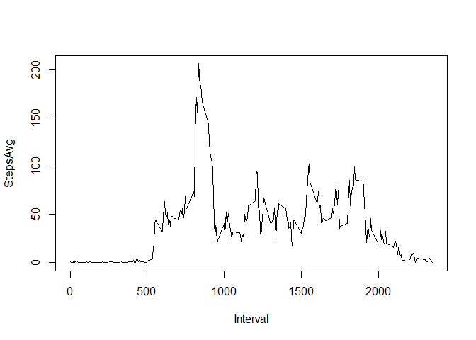

By Sebastian Leal

## Loading and preprocessing the data

```r
# Load libraries
library(reshape2)
library(data.table)
```

```
## 
## Attaching package: 'data.table'
```

```
## The following objects are masked from 'package:reshape2':
## 
##     dcast, melt
```

```r
# Unzip and read file, with the proper data type for each column
activities <- read.csv(
  unz('activity.zip', 'activity.csv'),
  sep=",",
  colClasses=c("integer", "Date", "integer")
)
summary(activities)
```

```
##      steps             date               interval     
##  Min.   :  0.00   Min.   :2012-10-01   Min.   :   0.0  
##  1st Qu.:  0.00   1st Qu.:2012-10-16   1st Qu.: 588.8  
##  Median :  0.00   Median :2012-10-31   Median :1177.5  
##  Mean   : 37.38   Mean   :2012-10-31   Mean   :1177.5  
##  3rd Qu.: 12.00   3rd Qu.:2012-11-15   3rd Qu.:1766.2  
##  Max.   :806.00   Max.   :2012-11-30   Max.   :2355.0  
##  NA's   :2304
```


## What is mean total number of steps taken per day?

```r
stepsByDay <- with(activities, tapply(steps, date, sum, na.rm = T))
stepsByDayMean <- mean(stepsByDay)
stepsByDayMedian <- median(stepsByDay)
# Create histogram
hist(stepsByDay, breaks = 15)
# Add mean and median lines, with a legen do identify them
abline(v=stepsByDayMean, col="blue")
abline(v=stepsByDayMedian, col="orange")
legend(
  x="topright",
  legend=c(
    paste("Mean: ", round(stepsByDayMean)),
    paste("Median: ", round(stepsByDayMedian))
  ),
  fill=c("blue", "orange"),
  bty="n"
)
```

<!-- -->

## What is the average daily activity pattern?

```r
stepsByIntervalAvg <- reshape2::melt(tapply(
  activities$steps,
  activities$interval,
  mean,
  na.rm=T
))
names(stepsByIntervalAvg) <- c("Interval", "StepsAvg")
plot(stepsByIntervalAvg, type="l")
```

<!-- -->

Which 5-minute interval, on average across all the days in the dataset, contains the maximum number of steps?

```r
IntervalWithMaxSteps <- stepsByIntervalAvg[order(stepsByIntervalAvg$StepsAvg, decreasing = T),]
IntervalWithMaxSteps[1,]
```

```
##     Interval StepsAvg
## 104      835 206.1698
```

## Imputing missing values
How many NAs in the dataset

```r
sum(is.na(activities))
```

```
## [1] 2304
```

```r
activitiesWithoutNAs <- copy(activities)
# For NA steps, insert the average of the day
for(i in 1:nrow(activitiesWithoutNAs)) {
  if (is.na(activitiesWithoutNAs[i,]$steps)) {
    newSteps <- subset(
        stepsByIntervalAvg, Interval == activitiesWithoutNAs[i,]$interval
      )$StepsAvg
    activitiesWithoutNAs[i,]$steps <- newSteps
  }
}

stepsByDay <- with(activitiesWithoutNAs, tapply(steps, date, sum, na.rm = T))
stepsByDayMean <- mean(stepsByDay)
stepsByDayMedian <- median(stepsByDay)
# Create histogram
hist(stepsByDay, breaks = 15)
# Add mean and median lines, with a legen do identify them
abline(v=stepsByDayMean, col="red")
abline(v=stepsByDayMedian, col="green", lty=3)
legend(
  x="topright",
  legend=c(
    paste("Mean: ", round(stepsByDayMean)),
    paste("Median: ", round(stepsByDayMedian))
  ),
  fill=c("red", "green"),
  bty="n"
)
```

<!-- -->
Yes, we see that imputing missing values change a bit the initial figures. Now the mean and median are the same.


## Are there differences in activity patterns between weekdays and weekends?


```r
#weekdays(activitiesWithoutNAs$date)
#weekdays(activitiesWithoutNAs$date) %in% c("sábado", "domingo", "saturday", "sunday")

activitiesWithoutNAs[,"isWeekend"] <- NA
for(i in 1:nrow(activitiesWithoutNAs)) {
   if (weekdays(activitiesWithoutNAs[i,]$date)
       %in% c("sábado", "domingo", "saturday", "sunday")) {
       activitiesWithoutNAs[i,]$isWeekend = TRUE
   } else {
       activitiesWithoutNAs[i,]$isWeekend = FALSE
   }
}

weekendActivities <- subset(activitiesWithoutNAs, isWeekend == T)
weekdayActivities <- subset(activitiesWithoutNAs, isWeekend == F)
stepsByIntervalAvgWeekend <- reshape2::melt(tapply(
  weekendActivities$steps,
  weekendActivities$interval,
  mean,
  na.rm=T
))
stepsByIntervalAvgWeekday <- reshape2::melt(tapply(
  weekdayActivities$steps,
  weekdayActivities$interval,
  mean,
  na.rm=T
))
names(stepsByIntervalAvgWeekend) <- c("Interval", "StepsAvg")
names(stepsByIntervalAvgWeekday) <- c("Interval", "StepsAvg")

# Make the plot
plot(stepsByIntervalAvgWeekday,
     type="l",
     main="Avg Steps by Day Interval - Weekday",
     col="red")
lines(stepsByIntervalAvgWeekend, type="l", col="blue")
legend(
  x="topleft",
  legend=c("Weekdays", "Weekends"),
  fill=c("red", "blue"),
  bty="n"
)
```

<!-- -->
